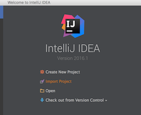
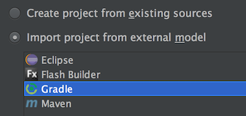
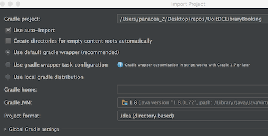
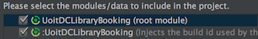

# UOITDCLibraryBooking
Build status:

Have a question?

## Description

[UOIDCLibraryBooking](https://play.google.com/store/apps/details?id=com.objectivetruth.uoitlibrarybooking) is an android app published to the Google Play Store.

It aims to streamline the booking of study rooms at the [University of Ontario Institute of Technology](https://www.uoit.ca)/[Durham College's](https://www.durhamcollege.ca) library located in **Oshawa, Ontario**

## History

Started as a pet project to learn `Android Development` in my spare time and was inspired by the frustration of using the current room booking system

https://rooms.library.dc-uoit.ca/uoit_studyrooms/calendar.aspx

It now has **350+ Installs** with an average **4.9** :star: review score.

I decided to **Open Source** the project to help students learn Android Development and make a contribution to something used everyday by their peers.

If you're interested in reading the frustrations/adventures of getting the project completed you can check out all the old articles on my blog :neckbeard:

http://www.objectivetruth.ca

Happy Coding!

-Miguel

## RoadMap

1. Code Cleanup (no major refactor)
2. Hook up a Continous Integration (CI) System. Jenkins? Travis?
3. Add basic tests
4. Major Refactor, possibly Kotlin?

## Development Environment Setup

### Existing IntelliJ installation (MacOSX)

IntelliJ is [free for students](https://www.jetbrains.com/student/). :books:

1. Install Android SDK

    Follow the instructions for [Installing Android SDK](http://developer.android.com/sdk/installing/index.html) choosing **Stand-Alone SDK Tools**

2. From the unzip directory, run `/tools/android` to launch the Android SDK Manager

    Ensure the following are installed to the latest:

    * Android SDK-Platform-tools

    * Android SDK Build-tools

    * Android 6.0 (API 23) 

        >All Components

    * Android Support Library

    * Google Play Services

    * Intel x86 Emulator Accelerator (HAXM)

3. Import the project to IntelliJ

    Select import project:

    

    Select Gradle project:

    

    Select the following Gradle import settings (default Global Gradle Settings):
        
    >You may need to set your Gradle JVM by pointing it to where Java is installed on your system. Run `echo $(/usr/libexec/java_home)` to find it

    

    Import all modules:

    

4. :question::question::question::question:

5. Profit :boom:

## License

--------

[GNU General Public License v3.0](http://choosealicense.com/licenses/gpl-3.0/#)

