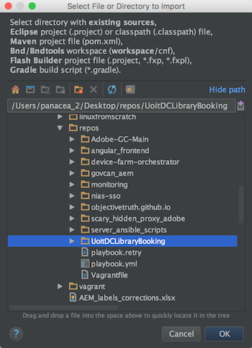
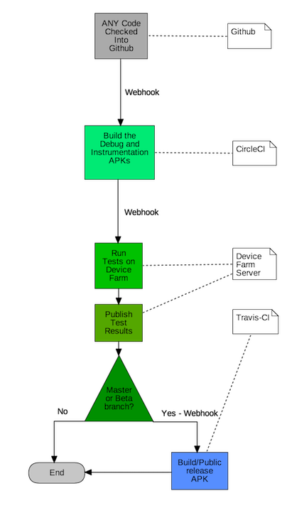

# UOITDCLibraryBooking

**Build Healthcheck :ambulance:**

| branch | tests | deployment | coverage |
| --- | --- | --- | --- |
| master(beta): |  |  |  |
| prod: |  |   |  |

[Join Beta(Android)](https://play.google.com/apps/testing/com.objectivetruth.uoitlibrarybooking)

[View Current Test Report with ScreenShots](http://testreports.uoitdclibrarybooking.objectivetruth.ca/)

Have a question? join our

## Description

[UOIDCLibraryBooking](https://play.google.com/store/apps/details?id=com.objectivetruth.uoitlibrarybooking) is an android app published to the Google Play Store.

It aims to streamline the booking of study rooms at the [University of Ontario Institute of Technology](https://www.uoit.ca)/[Durham College's](https://www.durhamcollege.ca) library located in **Oshawa, Ontario**

## History

Started as a pet project to learn `Android Development` in my spare time and was inspired by the frustration of using the current room booking system

https://rooms.library.dc-uoit.ca/uoit_studyrooms/calendar.aspx

It now has **350+ Installs** with an average **4.9** :star: review score.

I decided to **Open Source** the project to see if anyone wants to contribute and learn some Android Development while they're at it

If you're interested in reading the frustrations/adventures of getting the project completed you can check out all the old articles on my blog :neckbeard:

http://www.objectivetruth.ca

Happy Coding!

-Miguel

## RoadMap/Milestones:page_with_curl:

View the Milestones [here](https://github.com/ObjectiveTruth/UoitDCLibraryBooking/milestones)

## Branch Map :rotating_light:

**prod** = Code for the live Google Play Store App

**master** = Code for the Beta version.

To Opt-in to view the beta version on android click [here](https://play.google.com/apps/testing/com.objectivetruth.uoitlibrarybooking)

  **Warning:** Beta may be unstable and crash at any time, but you can see latest changes
  
## Architectural Design

See the [wiki - architecture](https://github.com/ObjectiveTruth/UoitDCLibraryBooking/wiki/Architecture-%28DI%29)

## Development Environment Setup

### Existing IntelliJ installation (MacOSX)

IntelliJ is [free for students](https://www.jetbrains.com/student/). :books:

1. Install Android SDK

    Follow the instructions for [Installing Android SDK](http://developer.android.com/sdk/installing/index.html) choosing **Stand-Alone SDK Tools**

2. From the unzip directory, run `/tools/android` to launch the Android SDK Manager

    Ensure the following are installed to the latest:

    * Android SDK-Platform-tools

    * Android SDK Build-tools

    * Android 6.0 (API 23) 

        >All Components

    * Local Maven repositories for Support Libraries
    
    * Android Support Library

    * Google Play Services
    
    * Google Repository

    * Intel x86 Emulator Accelerator (HAXM)
    
        >If your OS supports it

3. Import the project to IntelliJ

    Select import project:

    

    Select the directory where you cloned the project:
    
    >Learn how to [clone a git project](https://help.github.com/articles/cloning-a-repository/)

    

    Select Gradle project:

    >If you don't see Gradle, you may need to [install the IntelliJ Gradle Plugin](https://github.com/ObjectiveTruth/UoitDCLibraryBooking/wiki/Installing-IntelliJ-Gradle-Plugin)

    

    Select the following Gradle import settings (default Global Gradle Settings):
        
    >You may need to set your Gradle JVM by pointing it to where Java is installed on your system. Run `echo $(/usr/libexec/java_home)` to find it

    

    Import all modules:

    

4. :question::question::question::question:

5. Profit :boom:

## Code Pipeline

## License

--------

[GNU General Public License v3.0](http://choosealicense.com/licenses/gpl-3.0/#)

